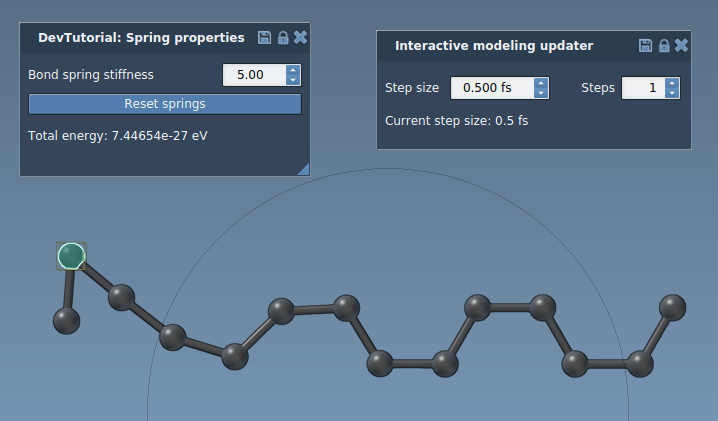

# Springs

This SAMSON Element demonstrates how to create a simple Bond Springs Interaction Model.

Please, refer to the [Springs interaction model tutorial](https://documentation.samson-connect.net/developers/latest/page_tutorial_spring_interaction_model.html).

